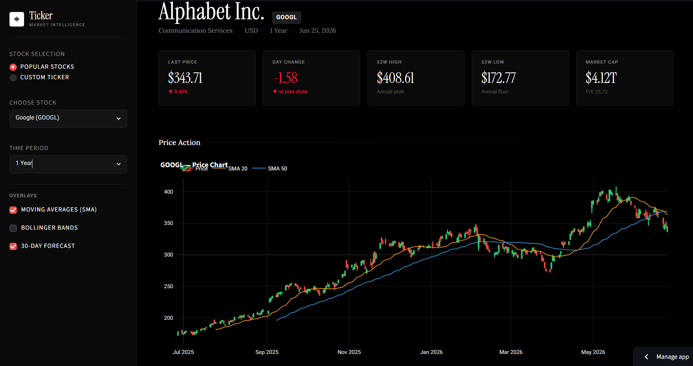

# ◈ Ticker · Stock Analyser & Forecaster

> **Project 06/100** — Building a bulletproof portfolio from scratch to break into AI/ML engineering.

[](https://iamxkhushi1726-svg-stock-price-analyser-app-d6xzch.streamlit.app/)

An elegant, high-performance market intelligence dashboard designed with a custom, ultra-minimalist black theme. It serves real-time stock data, charts technical overlays, and runs a machine learning regression model to forecast mid-term price direction—supporting both global tech giants and Indian NSE tickers.

**[Live Demo: Open the App](https://iamxkhushi1726-svg-stock-price-analyser-app-d6xzch.streamlit.app/)**

---

## 📸 The Interface




##  What it Does

- **Real-Time Market Tracking:** Hooks directly into the Yahoo Finance (`yfinance`) API to fetch live-delayed OHLCV data across custom time periods.
- **Bespoke UI/UX:** Styled explicitly with a premium dark-mode aesthetic using **Instrument Serif** for editorial-grade typography, **Lora** for sub-headers, and **Roboto** for razor-sharp telemetry readouts.
- **Technical Indicator Overlays:** Toggleable 20 & 50-day Simple Moving Averages (SMA) and Bollinger Bands computed dynamically on the fly.
- **Momentum & Volume Analysis:** Dedicated secondary charts highlighting RSI (14) overbought/oversold boundaries alongside volume trends.
- **Predictive Forecasting:** Trains an in-memory **Scikit-Learn Linear Regression model** on historical data to project price trajectories 30 days into the future, complete with trend direction flags (Upward vs. Downward).
- **Global & Indian Asset Native:** Works seamlessly for standard US equities (`AAPL`, `NVDA`) as well as Indian markets via the National Stock Exchange (`RELIANCE.NS`, `TCS.NS`).

---

##  The Tech Stack & Architecture

- **Frontend & Layout:** Streamlit (Custom CSS injection)
- **Visualization:** Plotly (Graph Objects & Express)
- **Data Engine:** Pandas, NumPy, yfinance
- **Modeling:** Scikit-Learn (Linear Regression)


```

stock-price-analyser/
├── src/
│   ├── data_loader.py   # yfinance connection, metadata mapping, and data caching
│   ├── indicators.py    # Math for SMA, RSI, and Bollinger Bands via pandas
│   ├── forecaster.py    # Sklearn regression model wrapper
│   └── charts.py        # Highly configured custom Plotly figures
├── app.py               # Main dashboard orchestrator & CSS injector
├── requirements.txt
└── README.md

```

---

##  Getting it Running Locally

Want to inspect the code or tweak the styles? Fire it up locally in less than two minutes:

1. **Clone the repo:**
   ```bash
   git clone https://github.com/iamxkhushi1726-svg/stock-price-analyser.git
   cd stock-price-analyser
   ```


2. **Install dependencies:**
    ```bash
    pip install -r requirements.txt
    ```


3. **Launch the Streamlit server:**
    ```bash
    streamlit run app.py
    ```

---

##  Dev Notes: What I Learned

Building this project wasn't just about rendering charts; it forced me to solve real architectural and UI hurdles:

* **Design System Rules Matter:** I realized that native Streamlit widgets can look generic. Injecting scoped `@import` Google fonts (`Instrument Serif` + `Lora`) into custom CSS classes completely changed the app's perceived premium value.
* **Vectorized Financial Math:** Writing algorithms like the Relative Strength Index (RSI) using pure Pandas vector operations rather than iterative loops taught me how to handle tabular series properly.
* **The Power of `@st.cache_data`:** To avoid hitting Yahoo Finance rate limits and causing terrible user lagging on every sidebar switch, I structured memory-safe caching parameters to keep UI re-renders near-instant.

---

##  The 100-Project Grind

This is **Project 06 out of 100**. I'm building 100 production-ready applications to relentlessly iterate on my engineering, data science, and design skills.

If you like this project or want to follow my journey toward breaking into top-tier AI/ML engineering teams, and follow my progress on my [GitHub Profile](https://github.com/iamxkhushi1726-svg).

